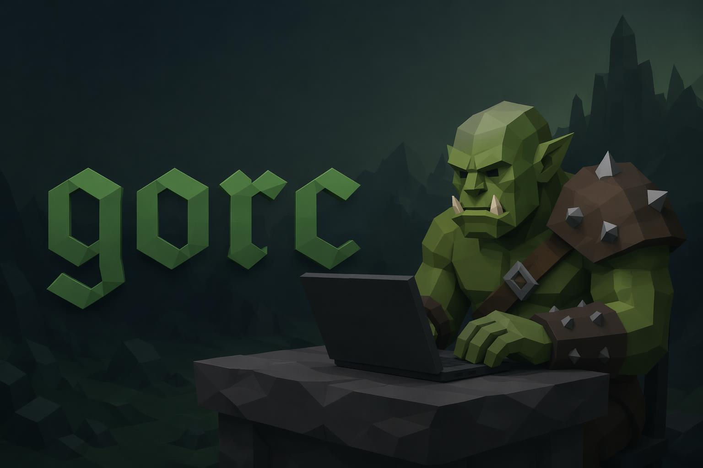

# gorc

<p align="center">
  
</p>

<table align="center">
  <tr>
    <td align="center">
      <a href="https://opencode.ai"></a>
      <a href="https://opensource.org/licenses/MIT"></a>
      <a href="https://github.com/balatD/gorc/stargazers"></a>
      <a href="https://github.com/balatD/gorc/issues"></a>
    </td>
  </tr>
  <tr>
    <td align="center">
      <a href="https://github.com/balatD/gorc/commits/main"></a>
      <a href="https://bun.sh"></a>
      <a href="https://www.typescriptlang.org"></a>
      <a href="https://github.com/balatD/gorc/pulls"></a>
    </td>
  </tr>
</table>

An [opencode](https://opencode.ai) plugin that ships a **conductor** primary
agent plus a **fleet of cheap subagents** — `go-research`, `go-reader`,
`go-implementer`, `go-qa` — and the orchestration logic to gate and observe
delegations.

The conductor plans, reasons, and delegates the grinding to budget models.
You stay in the expensive model's context for the thinking; the fleet does the
trawling, reading, and bulk editing.

## Install

Published to npm as `@balatd/gorc`. opencode auto-installs it on startup:

```jsonc
// opencode.jsonc
{
  "$schema": "https://opencode.ai/config.json",
  "plugin": ["@balatd/gorc"]
}
```

To make the conductor your default agent:

```jsonc
"plugin": [["@balatd/gorc", { "defaultAgent": "conductor" }]]
```

## The fleet

| Agent | Mode | Use for |
|---|---|---|
| `conductor` | primary | Plans, reasons, delegates. The only agent that may call `task`. |
| `go-research` | subagent | websearch + webfetch + read-only exploration of unfamiliar code. |
| `go-reader` | subagent | Targeted reads of code whose location is already known. |
| `go-implementer` | subagent | Applies planned edits and mechanical refactors across files. |
| `go-qa` | subagent | Read-only testability check on what the implementer just wrote. |

The conductor's `task` permission is force-gated to the four subagents — it
cannot delegate to anything else, even if you override the conductor in your
own config.

## Models

By default every agent targets the `opencode-go` provider:

| Agent | Default model |
|---|---|
| `conductor` | `opencode-go/glm-5.2` |
| `go-research` | `opencode-go/deepseek-v4-flash` |
| `go-reader` | `opencode-go/mimo-v2.5` |
| `go-implementer` | `opencode-go/deepseek-v4-pro` |
| `go-qa` | `opencode-go/deepseek-v4-flash` |

If you don't have that provider, point the fleet at your own models via
options — any field you omit keeps its default:

```jsonc
"plugin": [[
  "@balatd/gorc",
  {
    "conductorModel": "anthropic/claude-sonnet-4-6",
    "researchModel": "anthropic/claude-haiku-4-5",
    "readerModel": "anthropic/claude-haiku-4-5",
    "implementerModel": "anthropic/claude-sonnet-4-6",
    "qaModel": "anthropic/claude-haiku-4-5",
    "defaultAgent": "conductor"
  }
]]
```

### Options

| Option | Default | Effect |
|---|---|---|
| `conductorModel` | `opencode-go/glm-5.2` | Model for the conductor. |
| `researchModel` | `opencode-go/deepseek-v4-flash` | Model for `go-research`. |
| `readerModel` | `opencode-go/mimo-v2.5` | Model for `go-reader`. |
| `implementerModel` | `opencode-go/deepseek-v4-pro` | Model for `go-implementer`. |
| `qaModel` | `opencode-go/deepseek-v4-flash` | Model for `go-qa`. |
| `defaultAgent` | *(unset)* | If set (e.g. `"conductor"`) and you have no `default_agent` already, sets it. |
| `logDelegations` | `true` | Log every `task` delegation to the opencode log stream. |

## Overriding agents

Anything you define under `"agent"` in your own config wins — the plugin only
injects agents you haven't already defined. So to tweak a prompt or permission,
define that agent yourself and the plugin leaves it alone (the conductor's
`task` gating is still force-stamped, by design).

## The `test` command

Ships a `/test` command that invokes `go-qa` on your most recently edited
paths (or a path you pass it):

```
/test src/foo.ts
```

## How it works

A single opencode plugin (`src/index.ts`) uses the `config(cfg)` hook to
inject the five agents and the `test` command into your merged config, reads
each agent's prompt body from the bundled `agents/*.md` files at runtime, and
force-stamps the conductor's `task` permission so the fleet boundary can't be
widened by accident. A `tool.execute.before` hook logs every delegation.

## Develop

```bash
bun install
bun run build        # -> dist/index.js
```

Test locally by pointing your config at the built file:

```jsonc
"plugin": ["file:///Users/you/Projects/gorc/dist/index.js"]
```

## License

MIT
